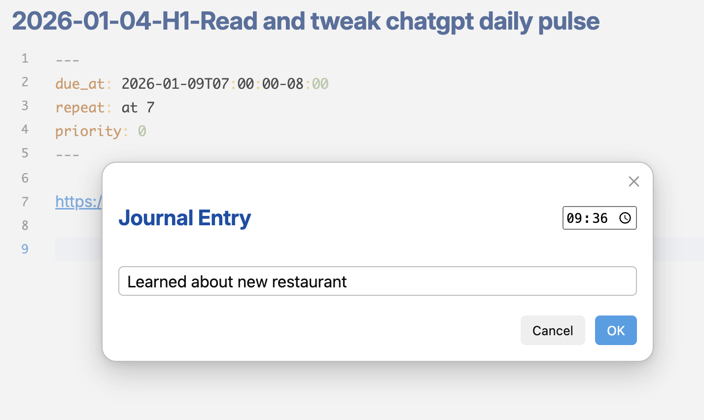
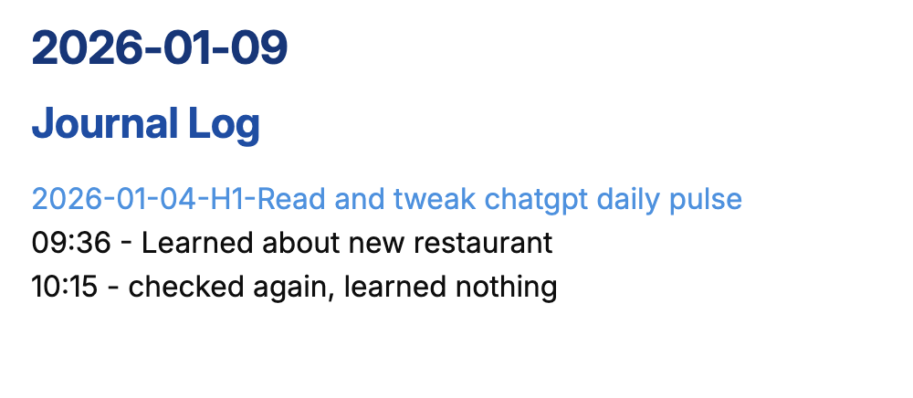

# Journal to Daily Note

Add entries quickly to your daily note from any file.

### The input:

### The journal entry in the daily note:

## Features

- Quick entry modal to add thoughts to your daily note without leaving your current context
- Automatic timestamp on entries
- Creates daily note if it doesn't exist

## Usage

1. Open the command palette (Cmd/Ctrl + P)
2. Search for "Add entry to daily note"
3. Type your entry and press Enter
